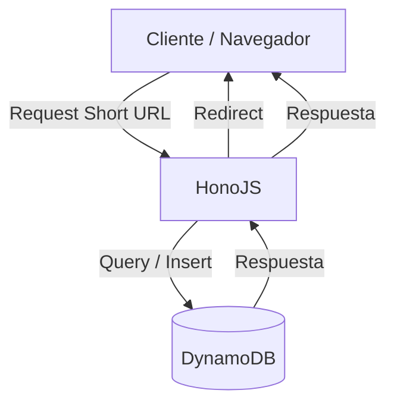

# URL Shortener – Serverless & Cloud-based

Un servicio de acortamiento de URLs **seguro, escalable y económico**, desarrollado con **[HonoJS](https://hono.dev/)**.

---

## 🚀 Tecnologías principales
- **Backend**: [HonoJS](https://hono.dev/)
- **Database**: [AWS DynamoDB](https://aws.amazon.com/dynamodb/)

---

## 🏗 Arquitectura



## 📦 Instalación local

### Requisitos previos

* [Bun](https://bun.sh/) o Node.js >= 18
* Configuración de AWS CLI y credenciales para DynamoDB local (opcional para desarrollo)

### Pasos

```bash
git clone https://github.com/tuusuario/url-shortener.git
cd url-shortener
bun install
bun run src/server.ts
```

---

## ☁️ Despliegue en AWS

```bash
serverless deploy
```

La URL pública se mostrará en la salida:

```
https://abc123.execute-api.eu-west-1.amazonaws.com
```

---

## 📈 Roadmap

* [x] Sprint 1: MVP local con HonoJS + DynamoDB
* [ ] Sprint 2: Deploy AWS Lambda + DynamoDB + Secrets en SSM
* [ ] Sprint 3: Cache Redis + Rate-limiting

---

## 🛡 Seguridad y buenas prácticas

* Validación de URLs con Zod.
* (Próximo) Rate limit per IP y API key.

---

## 📚 Créditos

Proyecto desarrollado por **[Daniel Torrealba](https://linkedin.com/in/daniel-torrealba-bravo)** como demostración técnica de arquitectura serverless moderna.
